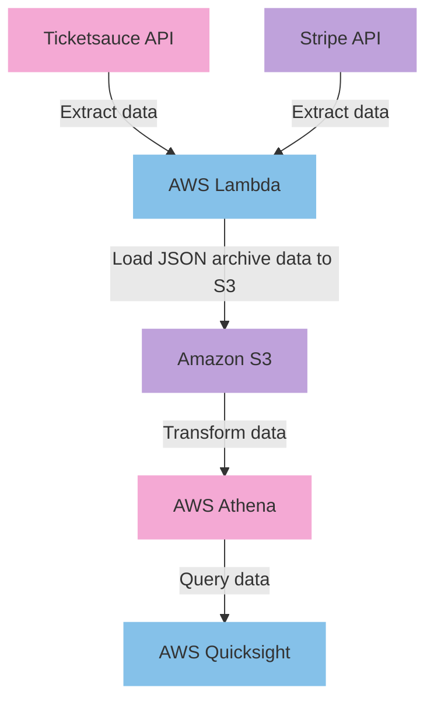
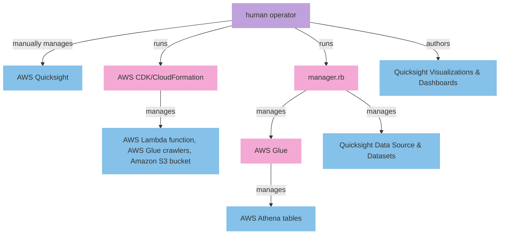

# Ticket Warehouse

Ticket Warehouse is a serverless data lake designed for warehousing and analyzing Ticketsauce API data. Utilizing AWS Lambda and Glue for ETL, AWS Athena for querying, and Quicksight for business intelligence, this project leverages the power of AWS for efficient data management. Infrastructure is managed as code using AWS CDK/CloudFormation.

## Architecture

### ELT Data Flow for Ticket Warehouse

In our ELT (Extract, Load, Transform) data flow, we embrace a modern approach that enhances efficiency by transforming data post-loading. This process begins with extracting data from both the Ticketsauce and Stripe APIs, utilizing AWS Lambda for the initial data retrieval. The extracted data is then loaded directly into Amazon S3 as JSON archives. Unlike traditional ETL processes, where transformation occurs before loading, our system leverages AWS Athena to transform the data after it is stored in S3. This approach allows for more flexibility and efficiency in handling large datasets. Finally, the transformed data is made queryable and accessible through AWS Quicksight, enabling advanced data querying and visualization, thereby providing insightful business intelligence.



### Infrastructure management




## Setup

### Step 1: Use CDK/CloudFormation to create the serverles resources

The Ticket Warehouse infrastructure consists of both pipeline and application stacks for multiple environments: staging, production, and development.

* **Pipeline Stacks:** Deploy these stacks once. They orchestrate the deployment process across different AWS accounts and environments.
* **Application Stacks:** These stacks contain the AWS resources for the Ticket Warehouse application. Deploy them for each respective environment (staging, production, development).

Refer to the [Ticket Warehouse CDK Application](documentation/runbooks/ticket_warehouse_working_with_cdk.md) runbook for detailed instructions, including prerequisites and deployment commands for both pipeline and application stacks.

### Step 2: Manual Initial Setup for Quicksight

After deploying the infrastructure, manually configure Quicksight in your AWS account. This step is essential for the subsequent use of manager.rb.

### Step 3: Load Initial Data and Create Athena Tables using manager.rb

Use manager.rb to load initial data from Ticketsauce into the data lake and then crawl it to create Athena tables.

```bash
bundle exec ruby manager.rb load
bundle exec ruby manager.rb crawl
```

### Step 4: Set Up Quicksight Data Source and Datasets

After creating Athena tables, run manager.rb to set up the Quicksight data source and datasets.

```bash
bundle exec ruby manager.rb quicksight source
bundle exec ruby manager.rb quicksight datasets
```

### Step 5: Create Visualizations and Dashboards in Quicksight
Finally, manually create visualizations and dashboards in Quicksight. This step involves designing the BI interface based on the datasets available in Quicksight.

## Management with manager.rb

`manager.rb`` streamlines management of the data lake:

`crawl`: Run Glue crawlers on the S3 data to create Athena tables.
`load`: Load data from Ticketsauce into the S3 bucket.
`purge`: Clear the S3 bucket and remove Athena tables.
`quicksight`: Manage Quicksight resources.
`reset`: Redo ETL and recreate Athena tables.

For detailed usage, refer to manager.rb help [COMMAND].

## Runbooks

- [Working with CDK](documentation/runbooks/ticket_warehouse_working_with_cdk.md)
